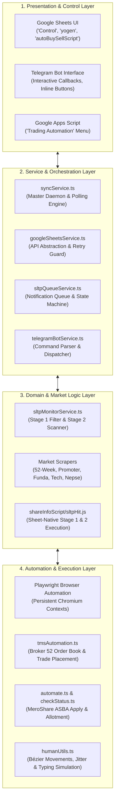

# NEPSE Trading & MeroShare Automation — Technical Documentation

This document provides a comprehensive technical reference for the architecture, service layer, automation components, and Google Apps Script integration.

---

## 🏛️ System Architecture

The application is structured into four primary layers:



---

## 📁 Component Breakdown

### 1. `syncService.ts` (Master Orchestrator Daemon)
- **Role**: Continuous background loop coordinating Google Sheet commands, cron tasks, and live queue workers.
- **Key Modules**:
  - `start10MinSLTPMonitor()`: Schedules live hit detection every 10 minutes during market hours.
  - `startTelegramBotListener()`: Long-polls Telegram for real-time user commands (`/proceed`, `/status`).
  - `pollSLTPHitsQueue()`: Checks `SL-TP-Hits` every 30 seconds for unnotified triggers.
  - **In-Memory Scheduled Crons (`node-schedule`)**:
    - `11:35 AM`: Promoter Share Unlock Scraper (`promoterUnlock.ts`)
    - `11:40 AM`: Fundamental Scraper (`fundaScraper.ts`)
    - `11:45 AM`: 52-Week High & Low Scraper (`week52Scraper.ts`)
  - **Dynamic TMS Execution**: Monitors cell `B1` in `autoBuySellScript`. When the target timestamp arrives, launches `tmsAutomation.ts`.
- **Fault Tolerance**: Global handlers for `unhandledRejection` and `uncaughtException` ensure unexpected runtime faults do not bring down the daemon.

---

### 2. `googleSheetsService.ts` (Google Sheets Data Bridge)
- **Role**: Centralized API interface managing authentication, rate limiting, and batch cell operations.
- **Key Features**:
  - `callWithRetry(fn, maxRetries)`: Exponential backoff wrapper protecting against Google Sheets API 429 quota exhaustion.
  - `initSheets()`: Authenticates using JWT Service Account credentials and loads the spreadsheet document metadata.
  - `appendAutoBuySellTrade(params)`:
    - Finds the first available row in `autoBuySellScript`.
    - Automatically updates cell `B1` to `Kathmandu Time + 2 Minutes` for timely TMS order dispatch.
    - Sets dynamic formula `=C{row}*D{row}` for automatic total calculation.
  - `getControlCommand()` / `updateControlStatus()`: Atomic reads and writes for the master `Control` tab.

---

### 3. `sltpMonitorService.ts` (Stop Loss / Take Profit Engine)
- **Role**: Executes Stage 1 portfolio filtering and Stage 2 live price scanning.
- **Key Functions**:
  - `formatPurchaseDate(val)`:
    - Robust normalization pipeline parsing:
      - Raw Excel serial date numbers (e.g., `46296` $\rightarrow$ `2026-10-01`)
      - Numeric serial strings (e.g., `"46296"` $\rightarrow$ `2026-10-01`)
      - US slash dates (e.g., `"10/01/26"`, `"10/1/2026"` $\rightarrow$ `2026-10-01`)
      - ISO date strings and native `Date` objects.
    - Prevents date format mismatch and duplicate row generation.
  - `generateUniqueStockId(symbol, kitta, price, purchaseDate)`:
    - Generates standardized keys: `SYMBOL-KITTA-PRICE-YYYY-MM-DD` (e.g., `NRIC-20-800-2026-10-01`).
  - `syncYogenToSLTPStocks()` (Stage 1):
    - Reads portfolio rows from `yogen` (Row 6+).
    - Filters rows where `Stop Loss (ST) > 0` or `Take Profit (TP) > 0`.
    - Appends new rows and updates existing rows in `SLTP-stocks` using Unique ID indexing.
  - `scanSLTPStocksAgainstLive(isScheduledRun)` (Stage 2):
    - Fetches real-time price feeds from ShareSansar / `live trading` tab.
    - Checks thresholds:
      - `Stop Loss`: `live.low <= SL`
      - `Take Profit`: `live.high >= TP`
    - Checks `existingHitsUniqueIds` in `SL-TP-Hits` to ensure duplicate hit entries are strictly prevented.
    - Appends triggered records to `SL-TP-Hits` with `Status = FALSE`.

---

### 4. `sltpQueueService.ts` (Queue & Notification Dispatcher)
- **Role**: Stage 3 consumer reading queued hits from `SL-TP-Hits`.
- **Key Functions**:
  - `pollSLTPHitsQueue()`:
    - Scans `SL-TP-Hits` for rows where `Status != true`.
    - Formats an HTML Telegram alert displaying stock symbol, volume, entry price, live LTP, day range, and triggered threshold.
    - Attaches an inline keyboard:
      ```
      [ Proceed ]  [ ❌ Dismiss ]
      ```
    - Registers the hit in memory via `registerPendingHit()` for `/proceed` command support.
    - Immediately marks `Status = TRUE` and writes the `Processed At` timestamp in Google Sheets.

---

### 5. `tmsAutomation.ts` (NEPSE TMS 52 Order Automation)
- **Role**: Automates trade placement in the NEPSE TMS 52 portal.
- **Key Functions**:
  - `runAutomation()`:
    - Reads pending BUY/SELL trades from `autoBuySellScript`.
    - Launches Playwright using `launchPersistentContextWithViewMode()` in `./tms_user_data` to preserve authentication state across runs.
    - Automatically handles login forms and detects dashboard arrival.
    - Automatically dismisses popups, announcement modals, and force-login dialogs.
  - **Duplicate Prevention via Daily Order Book**:
    - Navigates to **Daily Order Book** before submitting orders.
    - Compares planned trades against existing open orders. Skips order submission if matching Symbol, Qty, and Action already exist in the open order book.
  - `executeSingleTrade(page, action, symbol, qty, price)`:
    - Toggles between BUY and SELL.
    - Human-types Symbol, Quantity, and Price using randomized keypress intervals.
    - Submits the order and performs clean field reset.
    - Sends Telegram confirmation or failure alert upon completion.

---

### 6. `telegramBotService.ts` (Two-Way Telegram Interface)
- **Role**: Listens for incoming commands and callback queries from Telegram.
- **Interactive Flow**:
  - `proceed_sell:<SYM>:<QTY>:<PRICE>`:
    - Triggered when the user taps **Proceed** on an SL/TP notification card.
    - Calls `appendAutoBuySellTrade()` to enqueue the order into `autoBuySellScript`.
    - Sets scheduled execution for **Kathmandu Time + 2 Minutes** in cell `B1`.
    - Sends immediate visual feedback with an interactive card.
  - `/status`: Returns live uptime, active cron schedules, and Google Sheets polling state.
  - `/proceed [SYMBOL] [QTY] [PRICE]`: Allows placing orders directly via text command.
  - `/report`: Fetches the latest ASBA allotment status report.

---

### 7. `shareInfoScript/sltpHit.js` (Google Apps Script Engine)
- **Role**: Standalone Google Apps Script running natively inside Google Spreadsheet.
- **Key Features**:
  - **Dual Trigger System**:
    - `syncYogenToSLTPStocks()`: Configurable hourly trigger synchronizing eligible holdings.
    - `run10MinLiveTradingAndScan()`: 10-minute trigger that checks `Report!B1` (Market Open guard) and compares live prices against SL/TP.
  - **Identical Normalization Architecture**:
    - Implements the exact same `formatPurchaseDate(val)` algorithm as Node.js, guaranteeing cross-platform Unique ID parity (`SYMBOL-KITTA-PRICE-YYYY-MM-DD`).
  - **UI Integration**:
    - Adds a custom **`Trading Automation`** menu to the Google Sheets top navigation bar for one-click manual testing and trigger management.

---

## 📜 Google Apps Script Setup & Deployment Guide

To run Stage 1 and Stage 2 directly from Google Sheets:

### Step 1: Open Apps Script Editor
1. In your Google Spreadsheet, click **Extensions** $\rightarrow$ **Apps Script**.
2. Rename the project to `NEPSE Trading Automation`.

### Step 2: Paste Script Code
1. Open the file `Code.gs` (or create `sltpHit.gs`).
2. Copy the entire content from [shareInfoScript/sltpHit.js](file:///home/yogen/Desktop/workspace/playwrite/meroshare/shareInfoScript/sltpHit.js).
3. Paste it into the editor and save (`Ctrl+S`).

### Step 3: Authorize & Setup Triggers
1. Reload your Google Spreadsheet in the browser.
2. Click the new menu item **`Trading Automation`** $\rightarrow$ **`Setup Both Automated Triggers`**.
3. Accept Google's permission prompt when prompted (first time only).
4. The script will automatically configure:
   - **Hourly Trigger**: `syncYogenToSLTPStocks`
   - **10-Minute Market Trigger**: `run10MinLiveTradingAndScan`

---

## 📊 Google Sheets Contract & Data Schema

### 1. `yogen` (Source Portfolio)
- Row 1–5: Header summaries & metadata.
- Row 6+: Data rows:
  - `Col A (0)`: Symbol
  - `Col C (2)`: Kitta (Quantity)
  - `Col F (5)`: Purchase Price
  - `Col I (8)`: Purchase Date (Raw date / serial number)
  - `Col L (11)`: Stop Loss (ST)
  - `Col M (12)`: Take Profit (TP)

### 2. `SLTP-stocks` (Filtered Active Holdings)
- `Col A`: **`Unique ID`** (`SYMBOL-KITTA-PRICE-YYYY-MM-DD`)
- `Col B–N`: Replicated portfolio data from `yogen`
- `Col O`: **`Last Synced`** (Kathmandu timestamp)

### 3. `SL-TP-Hits` (Alert & Execution Queue)
- `Col A`: `Unique ID`
- `Col B`: `Symbol`
- `Col C–N`: Portfolio baseline values
- `Col O`: `Trigger Event` (e.g., `🛑 STOP LOSS HIT (Low <= SL)`)
- `Col P`: `Triggered At` (Timestamp)
- `Col Q`: `Live LTP`
- `Col R–S`: `Day High` / `Day Low`
- `Col T`: `Day % Change`
- `Col U`: **`Status`** (`FALSE` = Pending Queue Item, `TRUE` = Alerted)
- `Col V`: **`Processed At`** (Timestamp when Telegram alert was delivered)

### 4. `autoBuySellScript` (TMS Execution Queue)
- `Cell B1`: **Scheduled Execution Datetime** (Format: `YYYY-MM-DD HH:MM:SS`)
- `Row 3+`:
  - `Col A`: S.N
  - `Col B`: Symbol
  - `Col C`: Qty
  - `Col D`: Price (Leave empty for Dynamic / Market order)
  - `Col E`: Action (`BUY` or `SELL`)
  - `Col F`: Total (`=C{row}*D{row}`)

---

## 🧪 Testing & Verification Guide

### Automated Test Runner
A dedicated end-to-end test script is available in [testSLTP.ts](file:///home/yogen/Desktop/workspace/playwrite/meroshare/testSLTP.ts):

```bash
npm run test-sltp
```

### Verification Checklist:
1. **Date Normalization**: Confirms that numeric serials (`46296`), string serials (`"46296"`), slash formats (`"10/01/26"`), and Date objects all resolve to `2026-10-01`.
2. **Stage 1 Sync**: Executes `syncYogenToSLTPStocks()` and verifies that eligible stocks are indexed into `SLTP-stocks` with valid Unique IDs.
3. **Stage 2 Live Hit Detection**: Runs `scanSLTPStocksAgainstLive(false)`.
4. **Duplicate Prevention**: Verifies that existing Unique IDs in `SL-TP-Hits` are detected and skipped without creating duplicate entries.
5. **Sheet Integrity**: Prints row counts and records from both `SLTP-stocks` and `SL-TP-Hits`.

---

## 🛡️ Process Supervision & Production Deployment

For continuous 24/7 server deployment, the service runs under Linux **Supervisor** configured in [meroshare-supervisor.conf](file:///home/yogen/Desktop/workspace/playwrite/meroshare/meroshare-supervisor.conf):

```ini
[program:meroshare-watch-sheets]
command=/home/yogen/.nvm/versions/node/v22.22.0/bin/npm run watch-sheets
directory=/home/yogen/Desktop/workspace/playwrite/meroshare
user=yogen
autostart=true
autorestart=true
startretries=10
redirect_stderr=true
stdout_logfile=/home/yogen/Desktop/workspace/playwrite/meroshare/watch-sheets.log
stdout_logfile_maxbytes=20MB
stdout_logfile_backups=5
stopasgroup=true
killasgroup=true
```

- `stopasgroup=true` and `killasgroup=true` ensure that any child Playwright/Chromium browser processes are cleanly terminated when the daemon stops or restarts.
- Automatic log rotation keeps `watch-sheets.log` bounded to 20MB with 5 backups.
